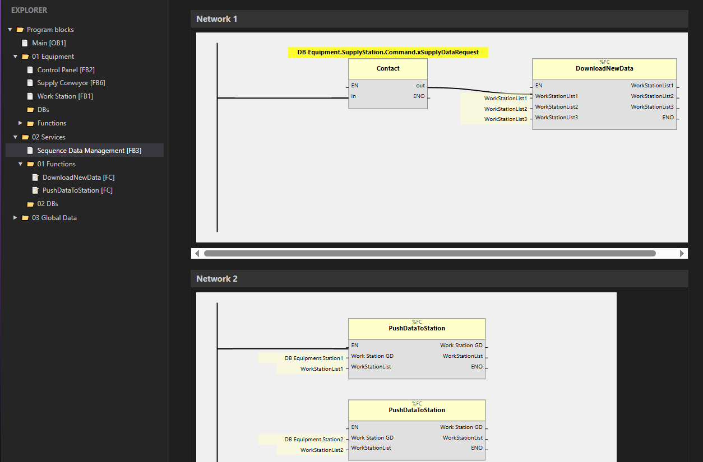

# TIA Portal Openness Parser

This project parses Siemens TIA Portal Openness XML and SCL files into a
hierarchical tree structure, extracting metadata like Block Type (OB, FB, FC,
DB, UDT), Name, Number, and network logic (LAD).

## Technologies

- Deno
- TypeScript
- fast-xml-parser

## Test it right now

Extract the Exaples/PLC_1.zip.

`deno run --allow-net --allow-read src/server.ts "Examples\PLC_1\Program blocks"`

Open http://localhost:8000 in your browser.



## File Structure

- `src/index.ts`: Entry point. Runs the parser on the `Examples` directory.
- `src/walker.ts`: Recursively walks directories and handles file
  identification.
- `src/parser.ts`: Contains logic to parse XML (using fast-xml-parser) and SCL
  (using regex) to extract block details.
- `src/types.ts`: TypeScript interfaces for the parsed data structure.
- `output_tree.json`: The result of the parsing process.

## How to Run

1. Ensure Deno is installed.
2. Run the parser:
   ```bash
   deno task start
   ```
3. Generate the HTML report:
   ```bash
   deno task html
   ```
4. Render an FBD block diagram:
   ```bash
   deno task render "path/to/Block.xml"
   ```
   Example:
   ```bash
   deno task render "Examples/PLC_1/Program blocks/01 Equipment/Control Panel.xml"
   ```
5. Check `output_tree.html` for the tree view or `output_fbd.html` for the
   diagram.

## PLC compiler/transpiler

This repository now includes a small compilation pipeline for TIA Openness
LAD/FBD style blocks:

- `src/compiler/flow_parser.ts`: converts raw network wires/parts into a
  flow-oriented IR (conditions, actions, calls).
- `src/compiler/backends/python_backend.ts`: emits typed Python modules.
- `src/compiler/backends/typescript_backend.ts`: emits typed TypeScript modules.
- `src/compiler/transpiler.ts`: backend orchestration layer.
- `src/compile_to_python.ts`: CLI orchestration that walks a PLC export folder
  and writes Python output.

Generated output includes both targets:

- `generated/python/*.py`: one module per FB/FC/OB + `runtime.py` +
  auto-generated `scl_stubs.py`.
- `generated/typescript/*.ts`: one module per FB/FC/OB + `runtime.ts` +
  auto-generated `scl_stubs.ts`.
- global exploration artifacts at output root:
  - `call_graph.json` (machine-readable nodes/edges),
  - `call_graph.dot` (Graphviz),
  - `call_graph.mmd` (Mermaid),
  - `call_graph.md` (xref-style table for quick navigation).
- each network is emitted as a typed `network_<n>` method/function body and SCL
  calls are converted into method calls.

Render the global call graph image:

```bash
python tools_render_call_graph.py
```

This writes `generated/images/call_graph.png` and
`generated/images/call_graph.svg` (both ignored by git).

Run it:

```bash
deno task compile "examples/PLC_1/PLC_1/Program blocks" generated python,typescript
```

This architecture keeps parser and backend separated so we can add a future
TypeScript backend without changing flow parsing.

Reference parser ideas from `block_diagram_z3` can be kept in `third_party/`
locally; this path is gitignored.


## Web UI call-graph navigation

Open the server UI and use the **Call Graph** menu in the sidebar:

- click a node to open that block in the tree and main view,
- click an edge label to open the caller block that contains the call site,
- drag nodes to move them; positions are saved in browser local storage.

